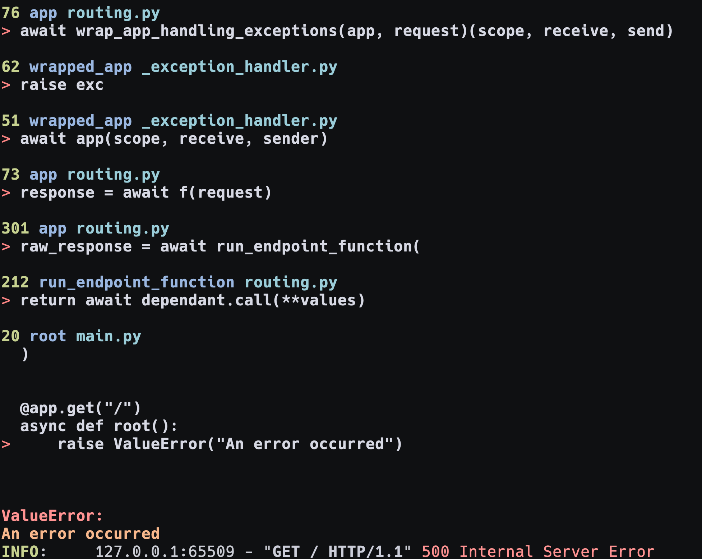

# FastAPI PrettyErrors Middleware

A FastAPI middleware to prettify exceptions using [PrettyErrors](https://github.com/onelivesleft/PrettyErrors).

## Installation

Install the package via pip:

```
pip install fastapi-pretty-errors
```

Or, if you’re using Poetry:

```
poetry add fastapi-pretty-errors
```

## Usage

Add the middleware to your FastAPI application:

```python
from fastapi import FastAPI
from fastapi_pretty_errors import PrettyErrorsMiddleware

app = FastAPI()
app.add_middleware(PrettyErrorsMiddleware)
```

### Custom Configuration

You can specify custom configuration options for PrettyErrors when adding the middleware. Any keyword arguments passed to PrettyErrorsMiddleware will be forwarded to `pretty_errors.configure()` .

```python
from fastapi import FastAPI
from fastapi_pretty_errors import PrettyErrorsMiddleware

app = FastAPI()

app.add_middleware(
    PrettyErrorsMiddleware,
    # PrettyErrors configuration options
    line_number_first=True,
    lines_before=5,
    lines_after=2,
    # ...
)
```

For a full list of configuration options, refer to the PrettyErrors [documentation](https://github.com/onelivesleft/PrettyErrors?tab=readme-ov-file#configuration-settings).

## Example

Here’s a step-by-step example demonstrating how to use `fastapi-pretty-errors` in a FastAPI application.

Create a file named `main.py` with the following content:

```python
from fastapi import FastAPI
from fastapi_pretty_errors import PrettyErrorsMiddleware
import pretty_errors

app = FastAPI()
app.add_middleware(
    PrettyErrorsMiddleware,
    line_number_first=True,
    lines_before=5,
    lines_after=2,
    line_color=pretty_errors.RED + "> " + pretty_errors.default_config.line_color,
    code_color="  " + pretty_errors.default_config.line_color,
    truncate_code=True,
    display_locals=True,
)


@app.get("/")
async def root():
    raise ValueError("An error occurred")
```

Start the FastAPI application:

```
fastapi run
```

Send a GET request to the `/` endpoint. The route raises an exception, so `fastapi-pretty-errors` returns a generic 500 error message to the client:

```
curl http://localhost:8000
{"detail":"Unexpected error occured."}
```

Check the terminal where the FastAPI application is running. You should see a formatted traceback provided by `fastapi-pretty-errors` :


